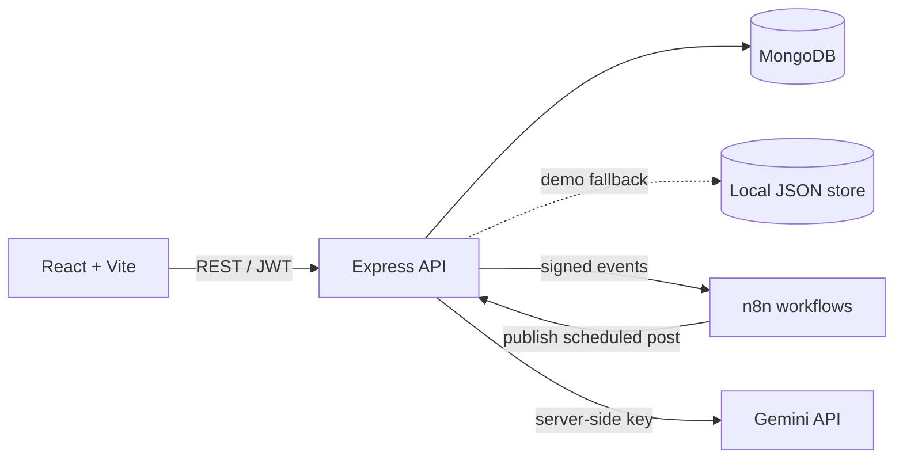

<<<<<<< HEAD
# FlowCMS

FlowCMS is a MERN-style CMS prototype with an editorial dashboard, dynamic public site, JWT auth, MongoDB persistence, Gemini-assisted content, and webhook-based n8n automation. It runs locally in demo mode without paid services; demo mode uses a durable local JSON store when MongoDB is unavailable.

## Features

- Admin dashboard, editorial pages/posts/categories, user roles, media upload, contact leads, SEO fields, analytics, and automation logs.
- Public routes `/`, `/about`, `/blog`, `/blog/:slug`, `/contact`, rendered from API content.
- Visual page builder with reusable sections, reorder/edit/remove, preview, save and publish.
- JWT registration/login, bcrypt password hashing, protected APIs and role middleware.
- Gemini integration stays on the server and falls back to clearly labeled demo content.
- n8n event webhooks with local fallback, signed secret verification, event logs, test connection, and scheduled publishing poll workflow.
- MongoDB models and configurable Mongo URI; JSON demo persistence makes setup immediate.

## Architecture



Contact workflow: `Public form → Express validation → MongoDB/JSON → n8n webhook → notification action (logged in demo) → automation log`.

## Requirements and setup

Node.js 20+ and npm. MongoDB is optional for demo mode.

```bash
cd outputs
npm install
npm --prefix server install
npm --prefix client install
Copy-Item server/.env.example server/.env
npm run seed
npm run dev
```

Dashboard: http://localhost:5173. API: http://localhost:5000/api. The development server proxies API and media requests.

### Demo accounts

- Super Admin: `admin@flowcms.test` / `FlowCMS123!`
- Editor: `editor@flowcms.test` / `FlowCMS123!`
- Author: `author@flowcms.test` / `FlowCMS123!`

## Environment

Copy `server/.env.example` to `server/.env`.

| Variable | Purpose |
|---|---|
| `PORT` | Express port (5000) |
| `CLIENT_URL` | Allowed browser origin |
| `JWT_SECRET` | Signing key; replace outside local demo |
| `MONGODB_URI` | Optional MongoDB / Atlas URI |
| `DEMO_MODE` | Enable labeled demo behavior |
| `GEMINI_API_KEY` | Optional server-side Gemini key |
| `N8N_BASE_URL` | Optional n8n origin |
| `N8N_WEBHOOK_SECRET` | Shared event signature secret |
| `CMS_BASE_URL` | API URL used by scheduled n8n workflow |

MongoDB connection falls back to the local JSON demo store if unavailable. Run `npm run seed` to reset and populate demo content.

## n8n

Import the JSON files in `n8n/workflows/`. Set `N8N_BASE_URL`, `N8N_WEBHOOK_SECRET` in server environment and the matching `N8N_WEBHOOK_SECRET`, `CMS_BASE_URL`, `CMS_SCHEDULE_TOKEN` in n8n. Activate workflows and set each webhook path as shown in the JSON. Without n8n, the same events are recorded as demo success in FlowCMS.

| Workflow | Webhook path |
|---|---|
| Contact Notification | `flowcms/contact-submission` |
| Blog Published | `flowcms/blog-published` |
| User Registration | `flowcms/user-registered` |
| Scheduled Publishing | Cron polling every minute; calls FlowCMS schedule endpoint |

## API overview

`/api/auth` register/login/me; `/api/users`; `/api/pages`; `/api/posts`; `/api/categories`; `/api/media`; `/api/contact`; `/api/ai`; `/api/automations`; `/api/settings`; `/api/analytics`; `/api/webhooks/n8n`; `/api/public`.

All write endpoints are RESTful. Admin/editor/author permissions are enforced server-side. Public contact submissions and public content reads need no login. Media uploads use local disk storage in `server/uploads`.

## Future enhancements

Cloud object storage, refresh-token rotation, granular permissions, collaborative editing, richer block styling, email provider, advanced analytics, and automated n8n workflow provisioning.
=======
# demo-project
>>>>>>> 812bb64ca89d22e5618d453baa7e344a520f3f65
